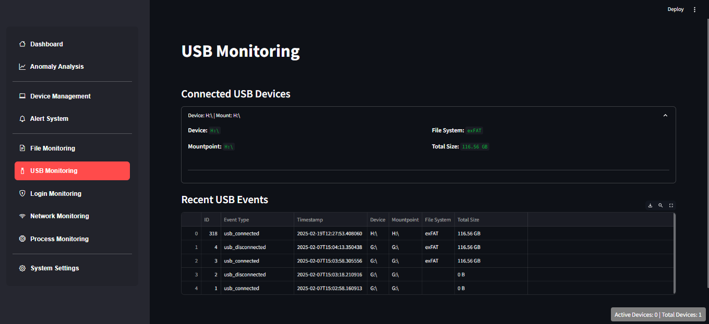

## Table of Contents
- [Project Overview](#ubms-dashboard)
- [Screenshots & Demo](#screenshots--demo)
- [Key Features](#key-features)
- [Installation & Running](#installation--running)
- [Project Structure](#project-structure)
- [How to Use](#how-to-use)
- [Contributing](#contributing)
- [License](#license)
  
# UBMS Dashboard

UBMS Dashboard is a comprehensive application designed for monitoring and managing devices on a network while detecting anomalous user behavior within an internal network using artificial intelligence techniques. The system continuously monitors various aspects such as USB connections, running processes, network traffic, login attempts, and file changes, and it presents live analytics, charts, and alerts via an interactive Streamlit-based user interface.

---
## Screenshots & Demo

Here are some screenshots of the UBMS Dashboard in action:

### Dashboard Overview


### Anomaly Analysis


### USB Monitoring


### File Monitoring


## Project Contents

- **Dashboard:**  
  Provides an overview of the system’s metrics, including the number of devices, events, alerts, and detected anomalies.

- **Anomaly Analysis:**  
  Utilizes an Isolation Forest model to analyze event data, detect anomalies, and display a summary per device along with a time-series chart of anomalies.

- **USB Monitoring:**  
  Tracks connected USB devices, displays detailed information about them, and logs events for USB connections and disconnections.

- **Process Monitoring:**  
  Lists the currently running processes and allows users to log a snapshot of the processes running on the system.

- **Network Monitoring:**  
  Captures and analyzes network traffic, applying rules to detect port scans and large data transfers. It displays statistics and interactive charts using Plotly and Altair.

- **Login Monitoring:**  
  Records login attempts and displays metrics on successful and failed logins with advanced filtering options.

- **File Monitoring:**  
  Monitors selected folders for file changes (creation, modification, deletion) and logs detailed event information in the database.

- **Device Management:**  
  Manages both real and virtual devices, including the automatic registration of devices (using MAC addresses) and creation of virtual devices.

- **Database Manager:**  
  Utilizes SQLite to store data for devices, events, alerts, login attempts, and network logs. The `db_manager.py` file contains functions for creating tables and performing basic CRUD operations on the database.

---

## Key Features

- ✅ **Comprehensive Monitoring:** Includes monitoring of **Network, Processes, File Changes, USB Activity, and Login Attempts**.
- 🧠 **AI Detection:** Uses **Isolation Forest** to detect abnormal behaviors.
- 📊 **Interactive Interface:** Built using **Streamlit** with live charts and statistics.
- 🔍 **Unified Data Logging:** All events are saved in **SQLite** database.
- 💻 **Device Management:** Supports automatic logging and management of physical and virtual devices.

---

## Requirements

- **Environment:**  
  - Python 3.7 or later  

- **Core Libraries:**  
  - Streamlit  
  - SQLite3 (included with Python) 
  - Scikit-learn  
  - scapy 
  - Pandas  
  - NumPy   
  - Plotly  
  - psutil   
  - watchdog  
  - tkinter

Install the required packages with:
```bash
pip install -r requirements.txt
```

---

## Installation & Running

1. **Clone the Repository:**
   ```bash
   git clone https://github.com/kameldeeb/ubms-v3.git
   cd ubms-v3
   ```

2. **Create and Activate a Virtual Environment:**
   ```bash
   python -m venv venv
   source venv/bin/activate   # For Linux/Mac
   venv\Scripts\activate      # For Windows
   ```

3. **Install the Dependencies:**
   ```bash
   pip install -r requirements.txt
   ```

4. **Run the Application:**
   ```bash
   streamlit run main.py
   ```

---

## Project Structure

```
ubms-dashboard/
├── app/
│   ├── services/
│   │   ├── db_manager.py         # Database management and logging functions
│   │   ├── usb_service.py        # USB monitoring services
│   │   ├── process_service.py    # Process monitoring services
│   │   ├── network_service.py    # Network monitoring services
│   │   ├── login_service.py      # Login monitoring services
│   │   ├── file_service.py       # File monitoring services
│   │   ├── device_service.py     # Virtual device management
│   │   └── device_manager_service.py  # Device registration and management
│   ├── utils/
│   │   ├── state.py              # Global state management for the application
│   │   ├── anomaly_detection.py  # Anomaly detection functions
│   │   ├── logger.py             # Alert logging
│   │   └── devices.py            # Device management UI utilities
│   └── views/
│       ├── dashboard.py          # Dashboard view
│       ├── analysis_view.py      # Anomaly analysis view
│       ├── usb_view.py           # USB monitoring view
│       ├── process_view.py       # Process monitoring view
│       ├── network_view.py       # Network monitoring view
│       ├── login_view.py         # Login monitoring view
│       ├── file_view.py          # File monitoring view
│       ├── alerts.py             # Alerts view
│       └── settings_view.py      # System settings view
├── data/                         # Folder to store the database and logs
├── main.py                       # Entry point of the application
└── README.md                     # This documentation file
```

---

## How to Use

1️⃣ **Open the Control Panel:** After launching the application, the control panel will appear, displaying an overview of the recorded data.

2️⃣ **Navigate between sections:** Use the sidebar to access different features such as **Anomaly Analysis, Network Monitoring, USB, Processes, Logging, and Files**.

3️⃣ **Manage Settings:** Alerts and monitoring settings can be customized through the dedicated sections.

4️⃣ **Monitor and Update Data:** The system logs all events to the **SQLite** database, allowing you to easily review and analyze the data.

---

## Contributing

Contributions to improve UBMS Dashboard are welcome! If you have suggestions or bug fixes:
- Fork the repository.
- Create a new branch for your feature or bug fix.
- Submit a pull request with a clear description of your changes.
- Open an issue if you need to discuss an idea or report a problem.

---

## License

This project is licensed under the [MIT License](LICENSE). Please refer to the LICENSE file for details.

---

## Acknowledgements

Special thanks to the open-source libraries and projects that made this project possible:
- [Streamlit](https://streamlit.io/)
- [scikit-learn](https://scikit-learn.org/)
- [psutil](https://pypi.org/project/psutil/)
- [watchdog](https://pypi.org/project/watchdog/)
- And many other libraries that contribute to the project.

---

> **Note:**  
> Due to the diverse functionality (network monitoring, USB, login tracking, and file monitoring), please refer to the documentation within each module for detailed information on customization and future development.

